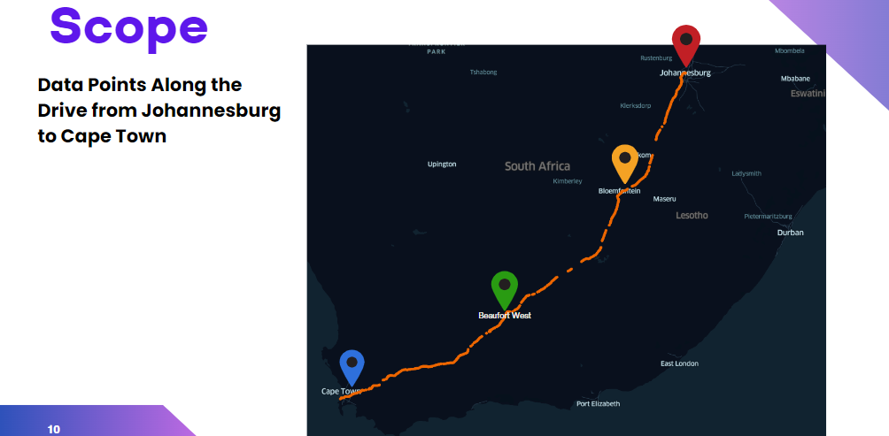
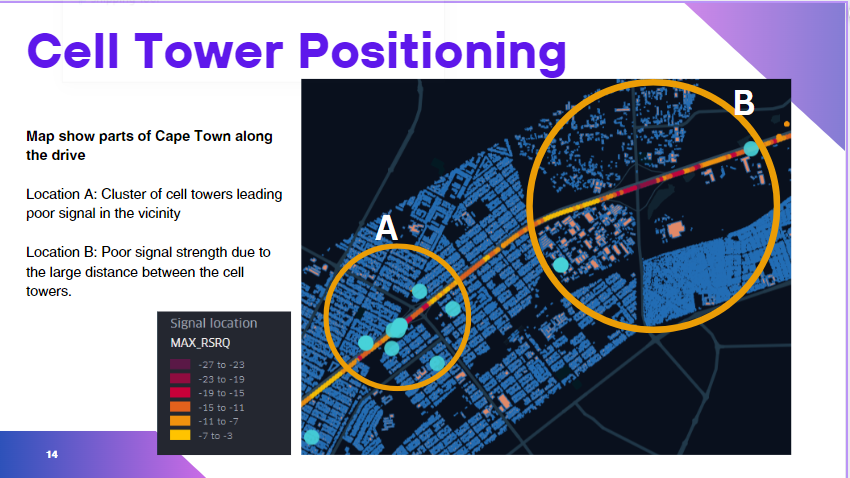
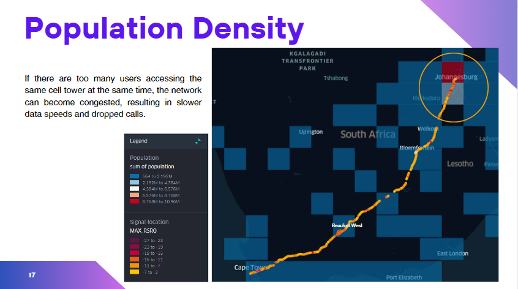
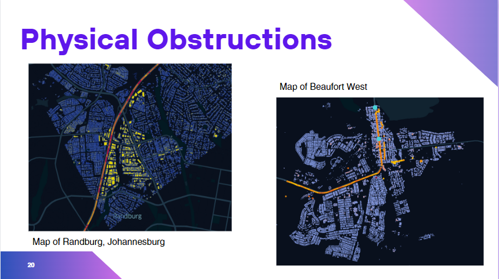
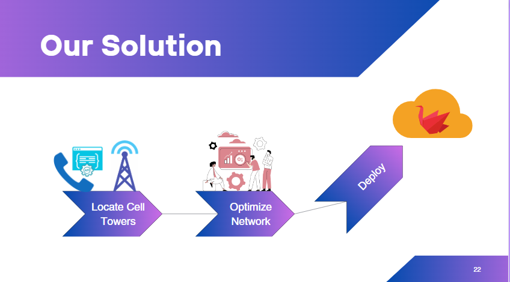
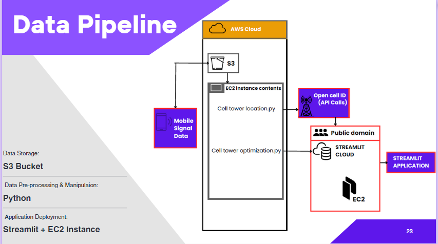

# Analysis-of-mobile-signal-strength

# Analyzing Mobile Signal Strength and Enhancing Network Performance

# Introduction
The evolution of mobile communication from 2G to 5G signifies remarkable advancements in speed, capacity, and connectivity. In our interconnected world, mobile devices have become indispensable, supporting various functions. Despite technological strides, challenges like dropped calls, slow data speeds, and connectivity gaps persist.
In this project, we tackled these challenges head-on, aiming to optimize mobile connectivity. This document provides an overview of our objectives, methodologies, findings, application demonstration, and recommendations. Additionally, you'll find a video link included to showcase the aesthetical usage of the web application we've built.

# Objective
* Conduct in-depth analysis of mobile signal strength data.
* Utilize large datasets from ExploreAI for comprehensive signal dynamics examination.
* Explore machine learning for predicting cell tower locations.
* Provide telco network optimization suggestions based on analysis insights.
* Optimize mobile tower placement to enhance coverage and reduce interference.
* Improve network performance using data-driven recommendations.

# Tools Used
* Jupyter Notebook (Python)
* Matplotlib, Seaborn, Pandas, Numpy
* Folium, Datetime, Math
* Plotly.graph_objects, Plotly.express
* Scipy.fft, Requests, Json, Random
* Geopandas, Contextily, Statsmodels.api, Pyspark
* Kepler.gl, Streamlit
* Visual Studio Code (VS Code)

# My Role
## My contributions to this project include:
* Consolidated raw datasets from AWS S3 into an accessible format.
* Analyzed mobile signal data, including power, quality, and interference ratio.
* Conducted geospatial and time series analysis for valuable insights.
* Managed project progress with Trello.
* Developed the Exploratory Data Analysis page on Streamlit.
* Deployed the Streamlit web app on AWS.
* Assisted in the documentation of the project in a comprehensive white paper.
* Presented the application's usage and functionality to stake holders and the general audience.

 # Project Highlights
 Here are some of the project highlights, 
 ## Scope
 Utilizing ExploreAI's exclusive tool, we conducted a comprehensive analysis of mobile signal strength data collected during the Johannesburg to Cape Town drive. The valuable insights derived from our analysis empowered us to provide recommendations aimed at enhancing network performance. 

 The map above utilizes Kepler.gl to visually depict the journey and signal dynamics, showcasing key points from the drive between Johannesburg and Cape Town.

## Geospartial Analysis
We formulated a hypothesis asserting that the distance between cell towers, the proximity of mobile devices to these towers, and the clustering of cell towers significantly impact signal quality. To validate this hypothesis, we conducted a comprehensive geospatial analysis, visually representing the correlation between the clustering of cell towers and distance with signal quality.
Upon completion of the geospatial analysis, we observed specific locations exhibiting below the desired standard signal quality. These issues were attributed to either the clustering of cell towers or the positioning of devices at the edge of the nearest cell tower's reach.

The map illustrates specific areas within Cape Town along the designated drive.
At Location A, a concentration of cell towers forms a cluster, leading to suboptimal signal quality in the surrounding area. Conversely, at Location B, the observed poor signal strength is attributed to the considerable distance from the nearest cell towers.

## Population Density
Based on our analysis, it was evident that signal quality in Johannesburg, particularly in areas characterized by high population density, tends to be weaker compared to the signal quality observed in other less densely populated towns and cities along the route.

The map depicts the population density of South African cities, with the color of the squares serving as a visual representation of population density, as indicated in the legend adjacent to the map.

## Physical Obstruction
Based on our insights, we found that the size of nearby buildings affects the signal quality.

The left map illustrates the buildings in Randburg, Johannesburg, with blue representing smaller structures and yellow denoting larger ones. Signal quality along the road is indicated by bands of yellow to red. Notably, the signal weakens in proximity to large buildings but gradually improves with increased distance.
Similarly, the right map portrays buildings in Beaufort West, displaying signal quality along the road. Unlike Randburg, Beaufort West experiences less impact from buildings as most structures are small-sized. The overall signal quality in this town is comparatively better, likely influenced by a smaller population and diminutive buildings.
Addressing challenges posed by physical obstructions is integral to our endeavor to optimize mobile signal strength. Developing solutions that account for these obstacles is pivotal in creating a more robust and reliable mobile communication experience for users.

# Solution Approach

Our solution strategy commences with the development of the Cell Tower Locator Engine, an integral component embedded within the ConnectXplorer App. This algorithm plays a pivotal role in pinpointing the origin points of signal metrics, essentially identifying where the signals originate.
In conjunction with the Cell Tower Locator Engine, our Network Optimization Engine seamlessly integrates into the ConnectXplorer App. This sophisticated algorithm employs intelligent technology to ensure smooth network operations. It adeptly manages data traffic, boosts internet speed, and optimizes the utilization of network resources, functioning as a traffic controller for your internet. This guarantees an optimal experience even during peak usage periods.
All these robust algorithms are seamlessly embedded within the ConnectXplorer Web App. This integration allows users to access and leverage advanced features directly through the app, providing a comprehensive and straightforward network management experience. The user-friendly ConnectXplorer App facilitates effortless network monitoring, offering insights for well-informed decision-making.

# Data Pipeline

Within our integrated workflow, we ensure the secure storage of all our data in an S3 bucket. Leveraging the adaptability of Python, we conduct thorough data pre-processing and manipulation. Subsequently, we utilize the combined capabilities of Streamlit and an EC2 instance to ensure the seamless deployment of our applications.

# Project Demo
[Here](https://www.youtube.com/watch?v=Vha8x66qtuI) is a video showcasing our web application (ConnectXplorer) in action.

# Limitations
Our data limitations included:
- Lack of information about the height of cell towers.
- Absence of details regarding the type of antennas used for mobile signal transmission.
- Uncertainty about the direction in which the signal is propagated for each cell tower.
- Lack of information on the frequency of the mobile signal.
- Furthermore, our data was geospatially dynamic, meaning it was not recorded at a static location.

*Adding to the complexity was our limited domain knowledge. As we are not experienced in the field of telecommunications, it took time to grasp our objective and understand the dataset before embarking on the tasks at hand.*

# Conclusion
In conclusion, our journey has taken us through the world of mobile signal analysis, involving the identification of challenges and the development of practical solutions. Starting with understanding the background, we presented our innovative solution and explained the intricacies of our data pipeline. Ultimately, we created a fully functional web application using Streamlit and deployed it to the cloud. Through these efforts, we skillfully navigated the complexities of connectivity.

# Recommendation

**Cell Tower Location Optimization:**
- Investigating the frequency information transmitted by cell towers reveals a promising avenue for deeper exploration, presenting an opportunity to elevate the network performance of our model. This insight aligns seamlessly with the assumption that the likelihood of encountering disruptive signals due to interference increases in scenarios with clustered towers.

**Strategic Tower Placement:**
- We propose optimizing cell tower placement through strategic spacing at sufficient distances. This strategy aims to maximize signal strength, effectively mitigating interference and fostering an overall enhancement in network performance.

**Model Enhancement with Frequency Information:**
- To further improve the efficacy of our tool, we recommend incorporating frequency information into the mobile signal strength data for model enhancement.

**Enhanced Data Collection:**
- To refine your network strategy, we suggest implementing real-time timestamp recording during data collection. This addition allows the tool to accurately capture the dynamic nature of the dataset, providing invaluable information for more effective Time Series Analysis.

# Acknowledgments
**I extend my heartfelt appreciation to the exceptional team members who collaborated on this project:**
-  **Adekemi Folarin** (Data Scientist).
-  **Ajirioghene Oguh** (Data Scientist).
-  **Aldo Sauls** (Data Engineer).
-  **Monde Nkuna** (Data Engineer).
-  **Amaechi Ngwoke** (Data Scientist).
-  **Ayodele Marcus** (Data Scientist).
-  **Confidence Ogbonna** (Data Scientist).
-  **Funmani Thibela** (Data Scientist).
-  **Seye Ganranwei** (Data Scientist).
-  **Sumaya Hassan** (Data Scientist).
-  **Toka Ramakau** (Data Scientist).

**Special gratitude to our mentors:**
- **Aidan Helmbold** (Mentor).
-  **Farayi Myambo** (Mentor).
- **James Combrink** (Special Mentor).
- **Kwazi Mthembu** (Special Mentor).
- **Abubakar Gajimi** (Special Mentor).
- **Devin Pelser** (Special Mentor).
- **Zintle Faltein-Maqubela** (Internship Coordinator).
- **ExploreAI Academy** (Academy).
- **ExploreAI** (Internship).

Your dedication and expertise have been invaluable in the success of this project.